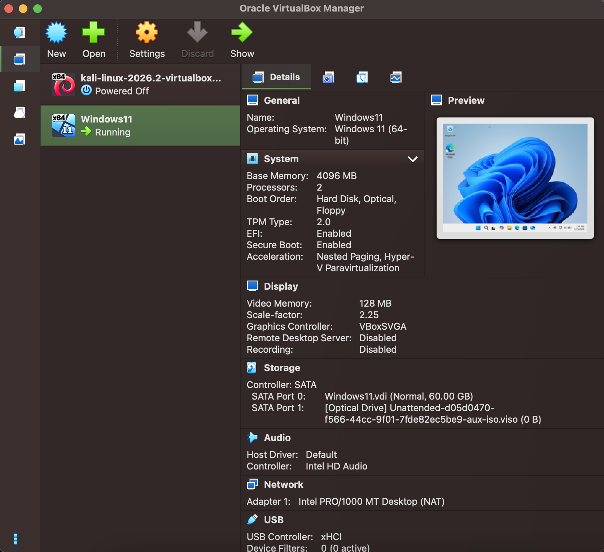
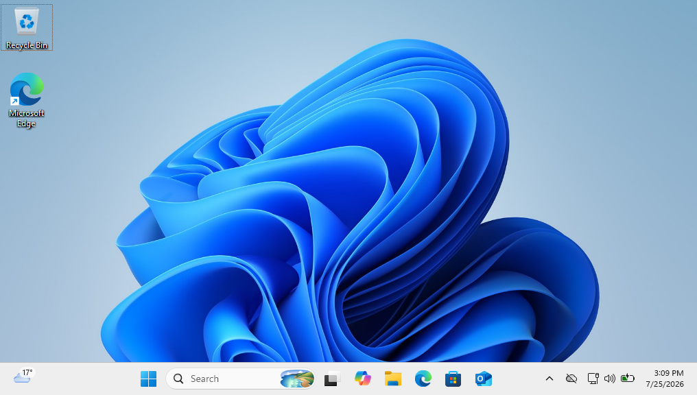

# Windows 11 Virtual Machine

## Objective
Set up a Windows 11 virtual machine to be the endpoint for my SOC home lab. This VM will be used to generate Windows security events, install Sysmon, forward logs to SIEM, and simulate attacks.

## Environment
- Oracle VirtualBox 7
- Windows 11 Home (Version 25H2)
- Memory: 4 GB RAM
- Processors: 2 vCPUs
- Storage: 60 GB (Dynamically Allocated VDI)
- Network: NAT

## Progress
### Completed
- Downloaded the Windows 11 ISO from Microsoft
- Created a Windows 11 VM in VirtualBox
- Installed VirtualBox Guest Additions and all available Windows updates
- Created a VirtualBox snapshot named Fresh Windows Install
- Created a standard local user account (socstudent) to simulate normal user and authentication activity during future labs

## Next Steps
- Install Sysmon and configure sysmon logging
- Install Wazuh

