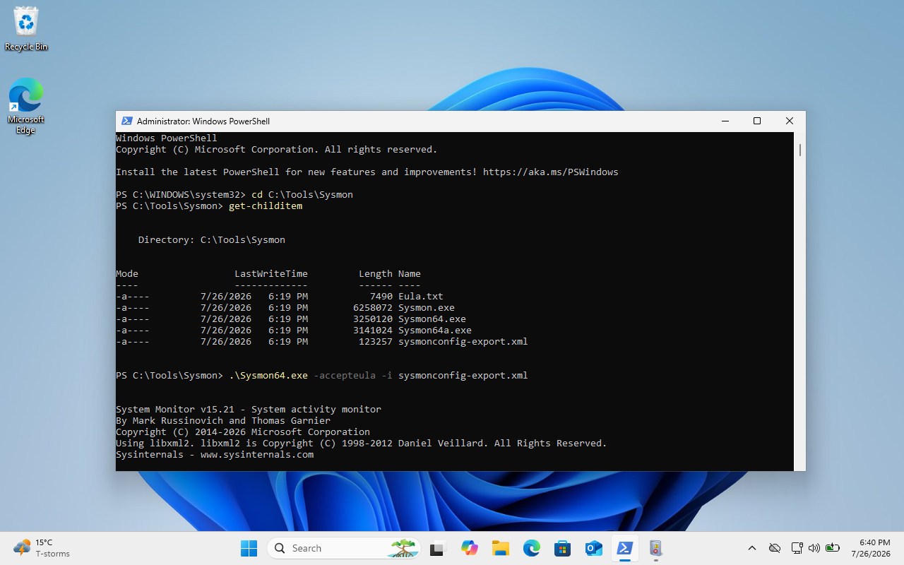
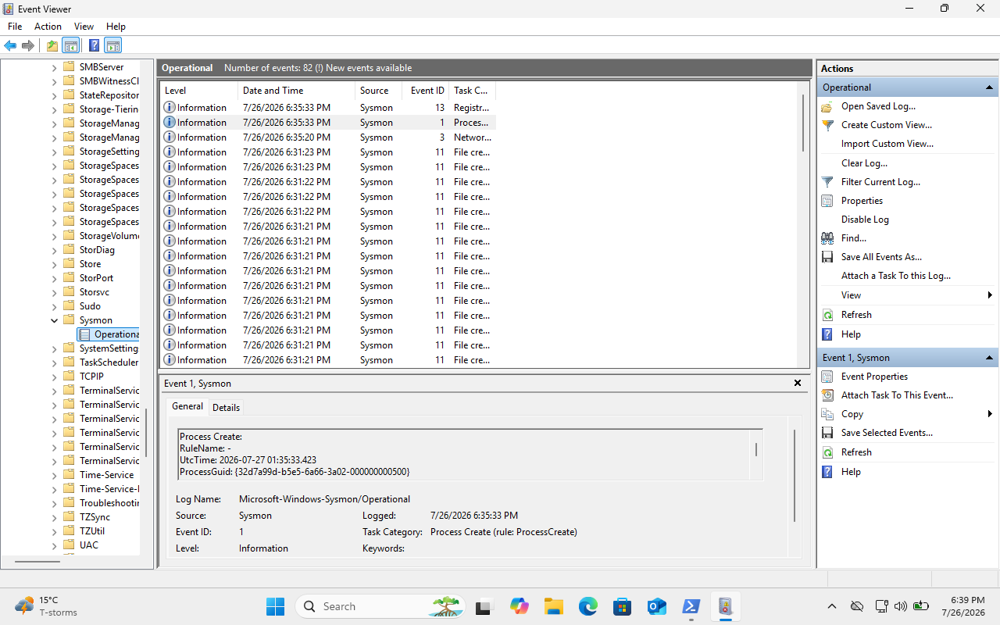

# Sysmon

## Objective
Install Sysmon on the Windows 11 VM to collect detailed endpoint activity logs for future projects. Learn how Sysmon works and how to read and interpret its logs.

## Environment
- Windows 11 Home 25H2
- Oracle Virtual Box
- Sysmon
- Sysmon XML configuration file from https://github.com/swiftonsecurity/sysmon-config

## Progress
### Completed
- Downloaded Sysmon from Microsoft Sysinternals and Sysmon XML configuration file
- Installed Sysmon using an administrator PowerShell session
- Verified Sysmon service was running and view logs through Windows Event Viewer
- Learned basic PowerShell Fundamentals
- Learned about Sysmon logs and how to interpret them

### Learning notes
- Basic PowerShell commands compared to Linux commands:
    - Get-Location = pwd
    - Get-ChildItem = ls
    - whoami = whoami
    - Get-Process = ps
    - Get-Process -Name <process> = ps aux | grep <process>
- Sysmon logs can be found in Event Viewer -> Applications and Services Logs -> Microsoft -> Windows -> Sysmon -> Operational
- Sysmon Event ID 1 is for Process Creation, which records when a process starts
- Important fields:
    - Image: The executable that started
    - ParentImage: The process that launched the executable
    - User: The account that executed the process
    - CommandLine: The exact command used to launch the process
    - Process ID: Identify what process it is
  - When investigating a process, should use the fields to ask: What executed? Who executed it? What launched it? Was the behaviour expected?

  ### Simple Investigation Example:
  Activity: Opened Notepad from the Windows Start menu

  Sysmon Event Analysis:
  - Image: C:\Windows\System32\notepad.exe
  - ParentImage: C:\Windows\explorer.exe
  - User: vboxuser
  - Command Line: C:\Windows\System32\notepad.exe

  This event showed that Notepad was launched by explorer.exe executed by the vboxuser account. This activity appears to be normal user behaviour.
  An example of suspicious behaviour is a document (ParentImage) launching Powershell (Image).

## Reflection
Learning Sysmon showed me how it enhances Windows Event Logs by providing more detailed information about endpoint activity. Understanding how to interpret Sysmon logs is an important skill for SOC investigations and will be useful in future projects.

## Next Steps
- Explore additional Sysmon events, including Event ID 3 (Network Connections), Event ID 11 (File Creation), and Event ID 13 (Registry Changes)
- Install Wazuh
- Create simulated security events and investigate alerts

